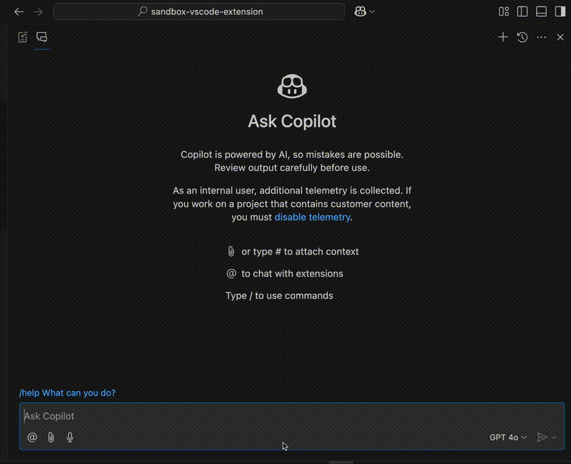
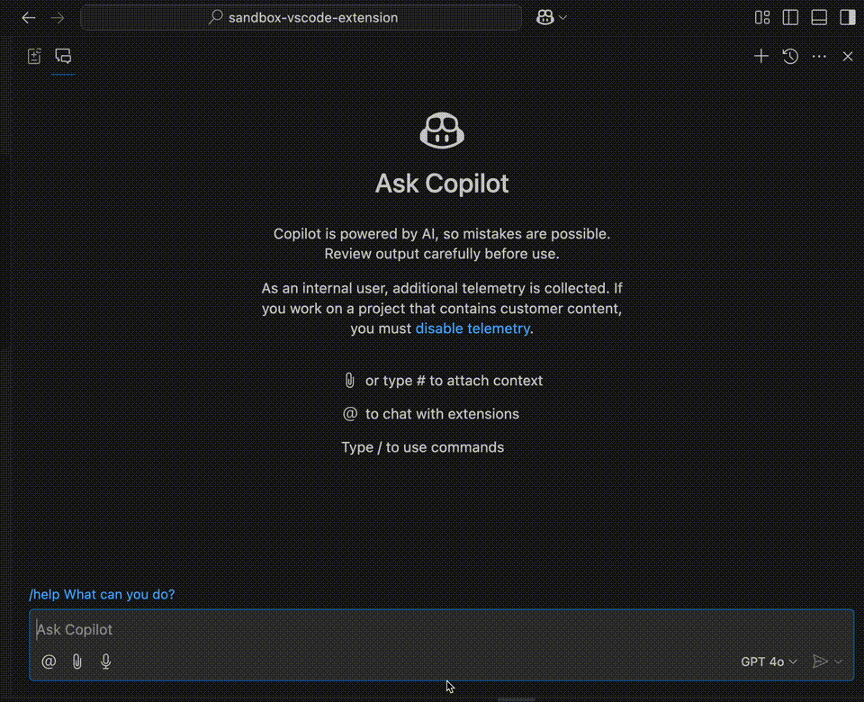
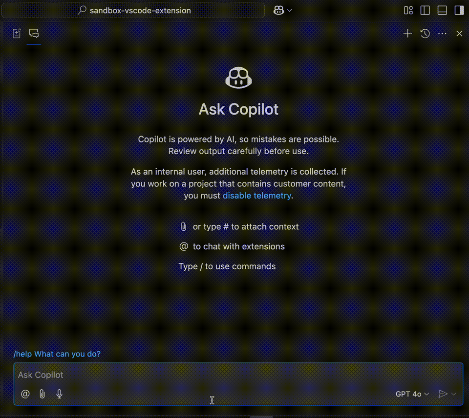

# sandbox-vscode-extension

This is a sandbox repository for creating a Visual Studio Code extension.

## Features

| Command          | Description                             | Video                                |
| ---------------- | --------------------------------------- | ------------------------------------ |
| `@cc /translate` | 日英に翻訳する                          |  |
| `@cc /boscar`    | BOSCAR フレームワークを適用して整理する |        |
| `@cc /summarize` | 要約する                                |  |
| `@cc /minutes`   | 議事録を作成する                        |      |
